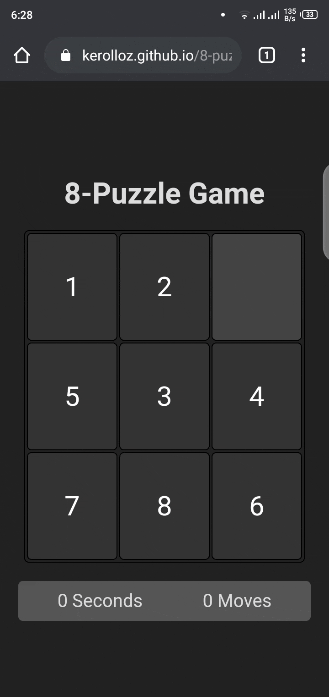

# 8-Puzzle Game

> A simple VueJS game

[**https://8-puzzle.pages.dev/**](https://8-puzzle.pages.dev/)

<div align="center">
  
</div>

## Project setup

```shell
npm install
```

### Compiles and hot-reloads for development

```shell
npm run serve
```

### Compiles and minifies for production

```shell
npm run build
```

### Lints and fixes files

```shell
npm run lint
```

### Customize configuration

See [Configuration Reference](https://cli.vuejs.org/config/).
